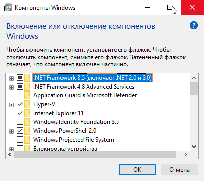

# Широкий вокабуляр
## Фичи винды
Они же:
- компоненты винды
- `OptionalFeatures.exe`
- `Включение или отключение компонентов Windows`.

<!-- footer -->
***
Думайте. Python Лайфхаки. [Подписаться](https://vk.com/pybug).
